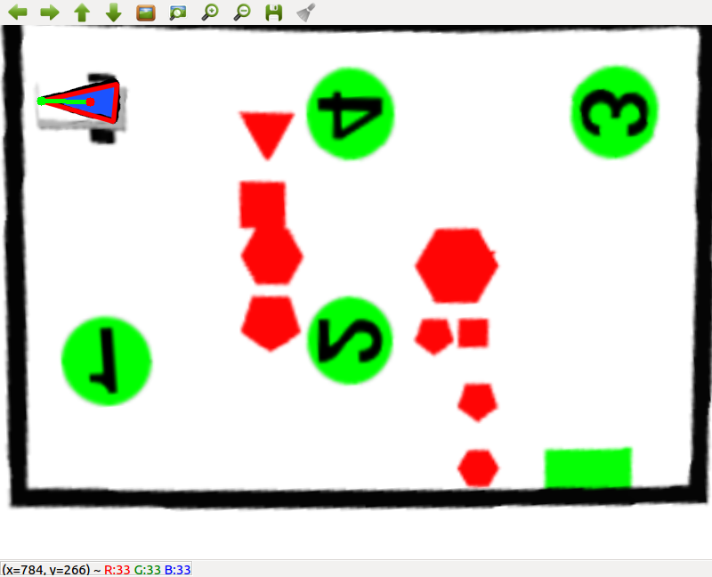

# Laboratory of Applied Robotics Student Interface


The technical documentation of the whole code base can be found inside docs folder in html and latex format.

```
docs/html/index.html
``` 


Also we can see 
## Image Saver

To do the intrinsic calibration , the steps to be followed are by running the AR_simulator_calibration and AR_pipeline_img_saver. Through this the images are saved from the simulator which contains checkerboard . Result of this function will be intrinsic parameters. To save the image, the function in genericImageListener in the student_interface.cpp was changed acccordingly.

```
Implemented Function:   genericImageListener
Functionality:  To store the images in the config folder
Function Available in:  src/student_interface.cpp
Reference for implementation:  professor_interface.cpp
Result available in:  All stored images can be found in camera_image_captured_gazebo folder.
```

## Intrinsic calibration

The intrinsic calibration was carried out using the tool that was provided during the lecture. There was no change done in the code. Just used the tool and got the intrinsic parameters in the xml format. And then I copied the parameters to the "camera_params.config" available in the config folder of professor interface. 

Used Tool: Calibration tool
Result available in:  camera_params.config


## Image undistortion

Using the distortion coefficients obtained in the previous steps, I need to remove the distorted effect on the image. This is done using the opencv undistort function.

```
Implemented Function:   imageUndistort
Functionality:  To Undistort the image and obtain the distortion coefficients
Function Available in:  src/extrisnicCalib.cpp
Reference for implementation:  professor_interface.cpp and opencv library
```


## Extrinsic Calibration

Now after the intrinsic calibration, I did the extrinsic calibration to determine the Rotational and translational matrix. Four points will be chosen in the image plane and then these 4 points will be solved using the solvePnP interface from opencv to solve the extrinsic problem. 
```
Implemented Function:   extrinsicCalib
Functionality:  To find the rotational and translational vector
Function Available in:  src/extrisnicCalib.cpp
Reference for implementation:  professor_interface.cpp and opencv library
Directly Copied functions: mouseCallback() and pickNPoints()
```
##Perspective Projection and Unwarping

Now to have a bird's eye view of the image, where we need to project the 3D objects in a image plane, I carried out Perspective Projection and Unwarping of image. This is again carried out the opencv interfaces. First, findPlaneTransform() has to caarried through which we get a perspective projection matrix, through which we can unwarp the image

```
Implemented Function:   findPlaneTransform() and unwarp()
Functionality:  To get a unwarped image
Function Available in:  src/extrisnicCalib.cpp
Reference for implementation:  professor_interface.cpp and opencv library
```
> Unwarp ground


> Unwarp Robot


## Process Map
After calibration, we need to process map is an important function for further navigation steps. It is decided that obstacles will be Red color with different shapes, gate as green rectangle and victims as green circles. 

### Obstacles detection- Red shapes

```
Implemented Function:  processObstacles()
Functionality: To get all obstacles information
Function Available in:  src/processMap.cpp
Reference for implementation:  professor_interface.cpp, demo code and opencv library
```

> Flow diagram of obstacle detection


> Obstacle detection Output


### Gate detection- Green Rectangle

```    
Implemented Function:  processGate()
Functionality:  To get all gate/Destination information
Function Available in:  src/processMap.cpp
Reference for implementation:  professor_interface.cpp, demo code and opencv library
```
> Flow diagram of Gate detection


> Gate detection Output


### Victim Detection - Green Circles

```
Implemented Function:  processVictims()
Functionality: To get all victims location
Function Available in:  src/processMap.cpp
Reference for implementation:  professor_interface.cpp, demo code and opencv library
```

> Flow diagram of Victims detection


> Victims detection Output


### Victim ID detection:

This is mainly done to detect the number of Victims, so that the priority to save the victims can be known to the planning algorithm. This involves template matching majorly and the templates were provided in lecture. I have used majorly the opencv template matching methods. But I also implemented the tesseract-ocr method, although the results were weird from them. None of the digits were recognized properly. 

I found a logic in internet somewhere about the digit recognition including the orientation. To put it in simple words, each template will be rotated by 5 degrees and then they are set to calculate the score and the maximum of all of that will be be finalized as digits. With this logic, the digits are getting recognized.

```
Implemented Function:   get_victim_id()
Functionality:  To get the victim's priority
Function Available in:  src/processMap.cpp
Reference for implementation:  professor_interface.cpp, demo code and opencv library 
```
> Flow diagram of Vicitm ID recognition


> Vicitm ID recognition Sample Output(Digit 3 recognized)


## Find Robot:
I directly utilized the function provided by the teaching assistant as I found that implementation was already in the best shape.

```
Implemented Function:   findRobot()
Functionality:  To get the robot location
Function Available in:  src/findRobot.cpp
```

> Flow diagram of Robot Detection


> Robot detection  Output



## Plan Path:
In Plan path function, I used RRT* planner from OMPL and also I have implemented an own RRT* algorithm which can be found inside src/RRTStar/ folder. But the OMPL planner one, works better as the library is completely organized and optimized to the core.The high level motion planning is obtained using the RRT* algorithm. The local planner between the  RRT* points are using Clothoids library or dubins planner. I have chosen clothoids as major one, because the curvilinear behaviour is quite good and the curvature values can be gradually approximated for the local path, But in case of dubins planner, the curvature values are either +MAX or -MAX.

> General diagram of planPath


Let me discuss one by one point

### Mission Planning:
 The mission 0 and mission 1 are quite easier. 

Mission 0 involces source to gate directly
Mission 1 involves source to all victims in priority and finally to gate

Mission 2 requires a bit of calculation.

> Mission 2 victims computation flow


### High level Motion planning(RRT* Planner)
For RRT* I have used two methods, one using the OMPL library and the other one was referred from an online source and modified accordingly. Although OMPL one performs better.

####OMPL RRT* Planner:
This planner is using the OMPL library and their interfaces

> RRT* planner computation using OMPL


#### RRT* Implemetaion
This planner was referred from the following link and modified accordingly (https://github.com/mpdmanash/rrt-star-dubins-sim) . The genral flow diagram of this planner can be found below

> RRT* planner computation 


### Clothoids Local planner
This local planner was integrated Using the Prof Enzo Bertolazzi's Clothoids library. The planner can be found in the following link (https://github.com/ebertolazzi/Clothoids). 

> Clothoids based local planner Flow 


### Dubins Local planner
This local planner is impleementied by solving the dubins curve problem.

> Dubins based local planner Flow 


 

##Plan Path results

### Mission 1 results

> High level RRT* planner path points 


> Local planner path points


### Mission 2 results

> High level RRT* planner path points 


> Local planner path points


